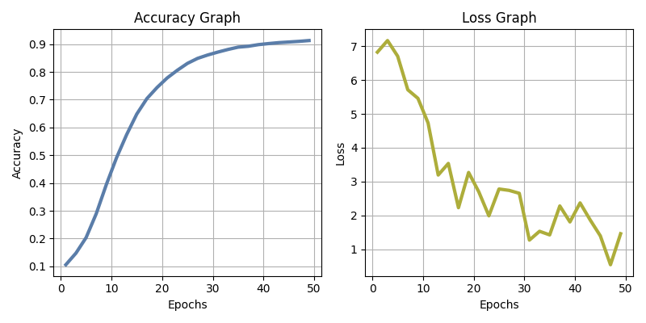

<!--

**Student**: 11912007, Yahya JABARY

**Topic**: 3.2.3: Deep Learning for Image/Text Classification, Next-word prediction (Language Modelling) using Deep Learning
-->

```
 _
 \`*-.
  )  _`-.
 .  : `. .
 : _   '  \
 ; *` _.   `*-._
 `-.-'          `-.
   ;       `       `.      autocomplete
   :.       .        \     ~~~~~~~~~~~~~~~~~~~~~~~~~~~~~~~~~~
   . \  .   :   .-'   .    a simple LSTM based language model
   '  `+.;  ;  '      :    for educational purposes
   :  '  |    ;       ;-.
   ; '   : :`-:     _.`* ;
.*' /  .*' ; .*`- +'  `*'
`*-*   `*-*  `*-*'
```

The language modeling task is to assign a probability for the likelihood of a given word (or a sequence of words) to follow a sequence of words, as in: $P(w_i | w_1, w_2, \ldots, w_{i-1})$.

In short, the goal is to predict the next word in a sentence given the previous words.

There are many ways to approach this task, and over the years, we have come a long way from traditional markov chains, n-grams to recurrent neural networks and the latest transformer models[^fst]. The transformer model [^attention] not only is better at capturing long-range dependencies than its predecessors like LSTM [^lstm] but also GPU parallelizable and doesn't need any sequence unfolding to be trained which resolves the vanishing gradient problem and massively speeds up training.

This recent breakthrough (among others) is the foundation of large scale language models like GPT-3, BERT (Bidirectional Encoder Representations from Transformers), and others.

This is a simple implementation of an LSTM based language model for educational purposes, trained on a dataset of fake and real news articles: https://github.com/GeorgeMcIntire/fake_real_news_dataset

_Development Process_:

-   **Choosing PyTorch:** I was curious which framework language models are most elegant to be implemented in. So I tried both PyTorch and TensorFlow following several tutorials (see: `./playground/`). I decided to stick to PyTorch.

-   **Choosing an initial LSTM model:** Next, I tried both a simple LSTM model and the built-in Pytorch `nn.Transformer` model. I found the LSTM model to be more a lot easier to follow. I found a Kaggle tutorial on LSTM based language models [^kaggle] I used as an initial starting point. This model was trained on a dataset of Medium article titles and seemed to perform reasonably well right out of the box.

-   **Choosing a dataset:** I modified the Kaggle model to run on multiple different datasets, in particular, a 0.5 GB Reddit dataset of comments from `r/jokes`. Due to the fact that it took too long to train on my local machine, I decided to pivot to a smaller dataset. I found an interesting dataset of fake and real news articles on GitHub.

-   **Optimizing:** I then optimized both the effectiveness and efficiency of the model by tuning hyperparameters and refactoring the code.

# Quantitative Results



I used seed 42 for reproducibility and settled on the following hyperparameters:

```python
{
    "batch_size": 32,
    "train_size": 0.8,
    "hidden_dim": 200,
    "epochs": 50,
    "dropout_prob": 0.5,
    "lr": 0.0009,
}
```

Resulting in the following best run:

```
0/50 [00:00<?, ?it/s]Epoch 0/50, Loss: 6.8260, Train K-Accuracy: 10.58%
2/50 [00:14<05:41,  7.11s/it]Epoch 2/50, Loss: 7.1692, Train K-Accuracy: 14.76%
4/50 [00:30<05:37,  7.33s/it]Epoch 4/50, Loss: 6.7071, Train K-Accuracy: 20.35%
6/50 [00:45<05:19,  7.27s/it]Epoch 6/50, Loss: 5.7136, Train K-Accuracy: 28.94%
8/50 [01:00<04:56,  7.05s/it]Epoch 8/50, Loss: 5.4600, Train K-Accuracy: 39.48%
10/50 [01:14<04:40,  7.02s/it]Epoch 10/50, Loss: 4.7324, Train K-Accuracy: 49.07%
12/50 [01:29<04:24,  6.96s/it]Epoch 12/50, Loss: 3.1925, Train K-Accuracy: 57.42%
14/50 [01:42<03:59,  6.66s/it]Epoch 14/50, Loss: 3.5348, Train K-Accuracy: 64.83%
16/50 [01:55<03:41,  6.51s/it]Epoch 16/50, Loss: 2.2261, Train K-Accuracy: 70.40%
18/50 [02:09<03:30,  6.58s/it]Epoch 18/50, Loss: 3.2683, Train K-Accuracy: 74.38%
20/50 [02:23<03:16,  6.56s/it]Epoch 20/50, Loss: 2.6988, Train K-Accuracy: 77.83%
22/50 [02:36<03:04,  6.60s/it]Epoch 22/50, Loss: 1.9860, Train K-Accuracy: 80.59%
24/50 [02:52<03:02,  7.01s/it]Epoch 24/50, Loss: 2.7795, Train K-Accuracy: 83.07%
26/50 [03:06<02:45,  6.88s/it]Epoch 26/50, Loss: 2.7380, Train K-Accuracy: 84.88%
28/50 [03:20<02:31,  6.87s/it]Epoch 28/50, Loss: 2.6520, Train K-Accuracy: 86.10%
30/50 [03:36<02:22,  7.13s/it]Epoch 30/50, Loss: 1.2683, Train K-Accuracy: 87.14%
32/50 [03:51<02:09,  7.20s/it]Epoch 32/50, Loss: 1.5286, Train K-Accuracy: 88.09%
34/50 [04:07<01:56,  7.28s/it]Epoch 34/50, Loss: 1.4217, Train K-Accuracy: 88.92%
36/50 [04:21<01:40,  7.17s/it]Epoch 36/50, Loss: 2.2776, Train K-Accuracy: 89.24%
38/50 [04:36<01:25,  7.10s/it]Epoch 38/50, Loss: 1.8056, Train K-Accuracy: 89.82%
40/50 [04:52<01:13,  7.37s/it]Epoch 40/50, Loss: 2.3679, Train K-Accuracy: 90.21%
42/50 [05:06<00:56,  7.09s/it]Epoch 42/50, Loss: 1.8625, Train K-Accuracy: 90.54%
44/50 [05:22<00:43,  7.19s/it]Epoch 44/50, Loss: 1.3927, Train K-Accuracy: 90.77%
46/50 [05:36<00:28,  7.05s/it]Epoch 46/50, Loss: 0.5396, Train K-Accuracy: 91.00%
48/50 [05:52<00:14,  7.31s/it]Epoch 48/50, Loss: 1.4568, Train K-Accuracy: 91.30%
50/50 [06:06<00:00,  7.34s/it]

Test K-Accuracy: 16.65%

Runtime: 06:06
```

Machine specs: `Darwin MBP 23.4.0 Darwin Kernel Version 23.4.0: Fri Mar 15 00:12:49 PDT 2024; root:xnu-10063.101.17~1/RELEASE_ARM64_T6020 arm64`

Unfortunately, the model is overfitting the training data and the test accuracy is quite low. This is likely due to the small size of the dataset and the simplicity of the model. The model could be improved by using a more complex model like bidirectional LSTMs, transformers, or a larger dataset.

# Qualitative Results

The qualitative results on the other hand are quite promising. The model is able to generate coherent sentences and even paragraphs. Here are some examples that I found particularly funny:

```python
input_test = [['top 3 things', 7], ['machine learning', 7], ['artificial intelligence is now', 7], ['why we cant have good things', 4], ['epic', 5]]
print(autocomplete(input_test))

>>> ['top 3 things to watch tonight in the presidential race',
>>>  'machine learning on the brink of war of syria',
>>>  'artificial intelligence is now a german and the election isn politics',
>>>  'why we cant have good things to the supreme court',
>>>  'epic nightmare revisited was correct winner']
```

I am quite happy with the results as they capture the spirit of news headlines quite well.

# How to run

Finally I containerized the project using Docker for reproducibility.

All you need to do is to run the following command:

```bash
docker-compose up
```

But beware that without a CUDA enabled GPU and some tweaking of the Dockerfile, the training process will take a long time.

# References

[^fst]: History of natural language models: Jing, K., & Xu, J. (2019). A survey on neural network language models. arXiv preprint arXiv:1906.03591. https://arxiv.org/pdf/1906.03591
[^attention]: Vaswani, A., Shazeer, N., Parmar, N., Uszkoreit, J., Jones, L., Gomez, A. N., ... & Polosukhin, I. (2017). Attention is all you need. In Advances in neural information processing systems (pp. 5998-6008). https://arxiv.org/pdf/1706.03762
[^lstm]: Hochreiter, S., & Schmidhuber, J. (1997). Long short-term memory. Neural computation, 9(8), 1735-1780. https://www.mitpressjournals.org/doi/abs/10.1162/neco.1997.9.8.1735
[^kaggle]: See: https://www.kaggle.com/code/dota2player/next-word-prediction-with-lstm-pytorch/notebook
